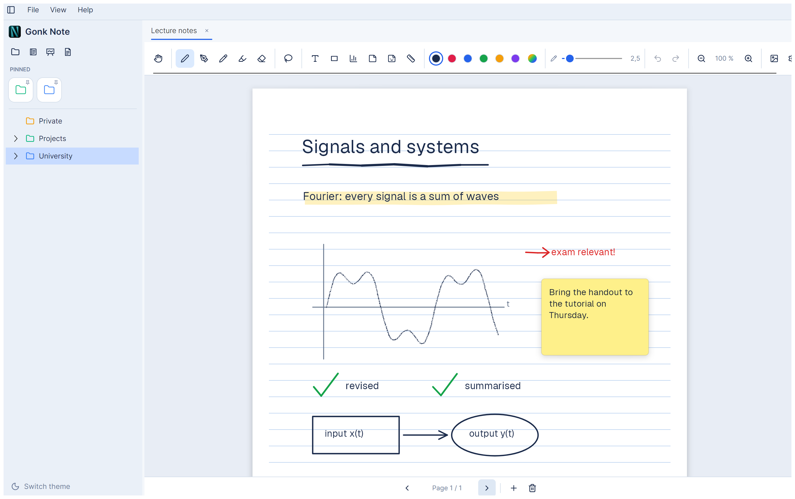
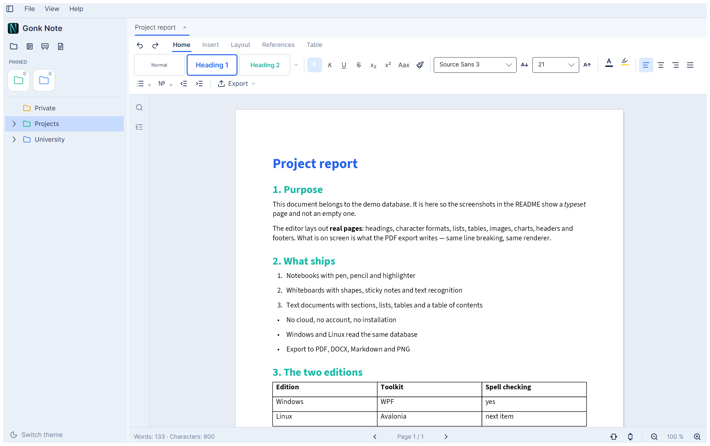
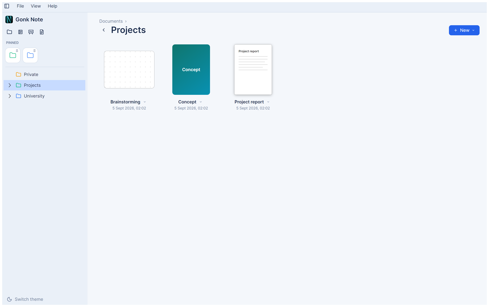

# Gonk Note

A modern, offline-capable note-taking app for **Windows 11 and Linux** — an alternative
to GoodNotes with notebooks, whiteboards and text documents. Stylus-friendly (Wacom,
Microsoft Pen, …), no cloud, no installer, no admin rights.

*(English version. The German original is [`README.md`](README.md). Inside the app this
page follows the language you picked under View → Language.)*



## Documentation

| You want to … | Read |
|---|---|
| **install** Gonk Note | [Docs/INSTALL.md](Docs/INSTALL.md) |
| **get started** (10 minutes) | [Docs/GETTING-STARTED.md](Docs/GETTING-STARTED.md) |
| know **what** the app can do | this README, the [Features](#features) section |
| **build** it yourself | [Build](#build) below, in detail in [Docs/INSTALL.md](Docs/INSTALL.md) |
| **contribute** | [CONTRIBUTING.md](CONTRIBUTING.md) |

## Install

**Three ways, none of them needs admin rights.** All downloads are under
[Releases](https://github.com/GONKstupid/GonkNote/releases); the details are in
[Docs/INSTALL.md](Docs/INSTALL.md).

1. **Windows 11** — unpack `GonkNote-<version>-windows-x64.zip`, run `GonkNote.exe`. No
   installed .NET needed. ⚠ **Keep the folder together:** `Fonts`, `tessdata` and
   `Assets` sit next to the exe, and without `Fonts` Gonk Note quietly draws in the
   Windows system font.
2. **Linux, AppImage** — one file, no dependencies, no sandbox. The only prerequisite is
   **fontconfig and one font**; text recognition is inside the image.
3. **Linux, Flatpak** — intended as the main channel, **not on Flathub yet**. Until then
   build it yourself (`packaging/flatpak/bauen.sh`).

> **Your data stays where it is.** On first start Gonk Note creates one folder —
> `%APPDATA%\GonkNote` on Windows, `~/.config/GonkNote` on Linux — and writes nowhere
> else. To uninstall, delete the program and that folder.

## Two editions, one app

Gonk Note comes as a **Windows edition** (WPF) and a **Linux edition** (Avalonia). Both
read the same database, use the same core library and draw with the same renderer — a
notebook looks identical on either.

**Both can do the same.** Everything under [Features](#features) applies to both: folder
tree, gallery, two languages, dark/light, your own themes, the canvas for notebooks and
whiteboards including text recognition — and the text-document editor with display,
import and export.

**The differences are listed in full** — every entry has been measured, none estimated:

| The Linux edition lacks | Why |
|---|---|
| **Composed characters** (`´` + `e` → `é`) do not arrive | A bug in Avalonia's window layer on Linux, reported there. Plain characters and umlauts are unaffected |
| **Ruler** above the text document | Deliberately left out: in the Windows edition it is decoration without function. The numbers are in the "Layout" tab and changeable there |
| **Existing documents from the Windows edition** appear only after being opened and saved there once | Their old format is readable on Windows only. Their contents stay untouched |

| The Windows edition lacks | Why |
|---|---|
| **Page numbers** in the text editor | It does not compute pages but lets Windows flow the text. The Linux edition typesets real pages and knows which one you are on |
| **Grammar checking** | It checks spelling through Windows only. The Linux edition also checks fixed rules (the same word twice, a space before a comma, a sentence starting in lower case) — and real grammar if a LanguageTool server runs on your own machine |

Nothing is lost along the way: whatever one edition cannot display, it does not touch —
a file created on Windows comes back out unchanged on Linux.



## Features

### Organising

- **Folder tree** with arbitrary nesting, drag & drop (move, hold `Ctrl` to copy),
  rename (`F2`), delete (`Del`), context menu, freely chosen icon colours — items and
  subfolders **inherit their folder's colour** as long as they have none of their own
- **Pinning & favourites**: pinned folders in quick access, favourites first
- **Gallery start view**: the current folder as large tiles (GoodNotes-style), with
  notebook covers as previews, breadcrumb and back
- **Two languages** (German/English), switchable under **View → Language** at runtime;
  document names stay unchanged
- **Dark/light mode** (`Ctrl+T`); pages stay light by default, the title bar follows the
  theme. The sidebar collapses with `Ctrl+B`
- **Your own themes**: a theme is a JSON file of up to twenty named colours in `Themes/`
  inside the data folder. `View → Theme` lists them next to Light and Dark; "Save
  template…" writes a starting point, "Load your own…" picks up a file from elsewhere.
  Whatever is missing comes from Light or Dark — three colours are enough. Guide and an
  AI prompt in
  [Docs/GETTING-STARTED.md](Docs/GETTING-STARTED.md#12-your-own-themes--including-with-an-ai)

  

### Notebook & whiteboard

- **Three document types**, each in its own tab: **notebook** (A4/A3 pages with a
  customisable cover), **whiteboard** (infinite canvas with a dot grid), **text
  document** (see below)
- **Tools** (SkiaSharp rendering; the default colour follows the page): pen
  (pressure-sensitive), pencil, highlighter
- **Shape pen** (`G`): recognises drawn shapes like GoodNotes — straight lines (snapping
  to 45°), circles/ellipses, rectangles, polylines; otherwise the curve is smoothed
- **Eraser**: splits strokes precisely at the point of contact, the back of the stylus
  erases automatically, its size remembered separately from the stroke width
- **Selection** with **lasso** (`L`) and **move** (`V`): selected objects can be moved,
  **scaled** (corner handle) and **rotated** (15° snapping) — strokes, shapes, text,
  images, sticky notes
- **Quick options menu** on the canvas (cut, copy, duplicate, paste, recognise text,
  delete, select all) — via right-click, the second stylus button, a long press or
  automatically after a selection; entirely without the keyboard
- **Stroke width via number pad**: a long press on the size slider opens a numpad
- **OCR** (offline via Tesseract, German/English): recognises printed text in selected
  images or imported PDF pages; copy the result or insert it as a sticky note
- **Shapes** (line, arrow, rectangle, ellipse, triangle) with fill colour and opacity
- **Text boxes** with a choice of font, text and background colour (contrast protection)
- **Sticky notes** and **stickers** (image stickers; Gonk Note ships none for licensing
  reasons — put your own into `Stickers/`, subfolders become groups)
- **Drawing aids**: ruler (`R`) and set square (`D`), rotatable and snapping; your own
  set-square SVG takes precedence
- **Insert images** (PNG, JPEG, BMP, GIF, WebP, SVG) via button, `Ctrl+V` or drag &
  drop, scalable proportionally
- **Insert PDF & Word** with a page selection dialog: in a notebook every page becomes a
  page of its own, in a whiteboard high-resolution, scalable images. **Very large PDFs
  too** — never loaded in one piece, only the pages you actually insert at full
  resolution
- **Touch gestures**: 1 finger pans, 2 fingers zoom (pinch), three-finger double tap =
  undo. Undo/redo (`Ctrl+Z`/`Ctrl+Y`), zoom (`Ctrl+mouse wheel`)
- **Settings sidebar** (gear icon): page pattern and shade, format, shape and text
  options, cover design, **export** (PDF/PNG straight away) — takes effect immediately

### Text-document editor

Ribbon layout (Home / Insert / Layout / References, plus the contextual tab **Table**):

- Character and paragraph formatting, styles (Normal, Heading 1–4, Title, Quote,
  header/footer), format painter, lists with a style library, find & replace
- **Advanced settings**: page setup (A4/A5/A3/Letter, orientation, margins in cm
  including a worksheet template), paragraphs, headers/footers with placeholders,
  watermark, table design/borders
- **Table of contents** from the headings, hyperlinks, special characters, captions
- **Tables like in Word**: grid insert, text↔table, quick tables, rows/columns, merge
  cells (vertically too)/split, split table, autofit, sorting, formulas
  (`=SUMME(ABOVE)` …), table styles with header/total rows and banded rows/columns,
  borders and shading
- **Charts** (column, bar, line, scatter, scatter+line, pie, radar — several series,
  colours extendable)
- **Spell checking** (both editions; German/English switchable in the status bar) with
  correction suggestions — on Linux with bundled dictionaries and a **grammar check** on
  top. Status bar (words, zoom), heading navigator, page-break marks
- **Import**: images, PDF, DOCX, **Markdown** (DOCX/Markdown become new text documents)
- **Export**: text document → PDF / DOCX / Markdown / PNG, whiteboard/notebook → PDF /
  PNG. If the original data for an image is missing, Gonk Note says so after the export

### Under the hood

- **Persistence**: a SQLite file `gonknote.sqlite` for texts, strokes and structure;
  **images and imported pages live next to it** in `gonknote.blobs/` — one file per
  image. Autosave every 30 s, plus a save on close. **For a backup, take both: the file
  *and* the folder.** Up to version 0.2.0 the file was called `gonknote.db` (LiteDB); it
  is migrated once on the first start after that and then stays unchanged. Sorted-out
  images move to `gonknote.papierkorb/` for 30 days
- **Large documents**: originals are stored untouched and written back untouched on
  export; what you see is a downscaled derivative. A Word document with photos comes out
  exactly as large as it went in; a 500-page text document opens in roughly 1.8 seconds
- **Memory use**: around 180 MB after startup, ~290 MB with a notebook open — regardless
  of document size, because only visible pages are held in memory. The undo history is
  capped at 200 steps

### Keyboard shortcuts in the whiteboard

| Key | Tool | | Key | Tool |
|---|---|---|---|---|
| `S` | Pen | | `T` | Text box |
| `G` | Shape pen | | `F` | Shapes |
| `B` | Pencil | | `N` | Sticky note |
| `M` | Highlighter | | `R` | Ruler |
| `E` | Eraser | | `D` | Set square |
| `V` | Move | | `H` | Hand (pan the canvas) |
| `L` | Lasso | | | |

Selection: move, scale, rotate · `Ctrl+C/X/V` · `Ctrl+D` duplicate · `Ctrl+A` select
all · `Del` delete · right-click / second stylus button / long press = quick options
menu.

## Build

Requirement: .NET SDK 10 or newer. **Always build per project, never the whole
solution** — it contains both editions, and the Windows edition cannot be compiled on
Linux.

```powershell
# Windows
dotnet run --project src/GonkNote.Wpf                 # development
dotnet publish src/GonkNote.Wpf -c Release            # single-file exe
```

```bash
# Linux (needs fontconfig + one font)
dotnet run --project src/GonkNote.Avalonia
```

For testing, `--db <path>` uses an alternative database — **work on a copy, never on
your real data.** All details, prerequisites and troubleshooting are in
[Docs/INSTALL.md](Docs/INSTALL.md).

## Architecture

The application consists of **one core and two interfaces**. Data model, persistence,
drawing routines, colours and translations live in the core; an interface only holds
what draws pixels or accepts input. That is why the Linux edition exists at all — it
rebuilt none of it.

| Building block | Technology |
|---|---|
| Windows interface | WPF (.NET 10), MVVM, resource dictionary built at runtime from the colour table in `GonkNote.Core` |
| Linux interface | Avalonia 12 (.NET 10), the same view models, the same colour table |
| Whiteboard rendering | SkiaSharp — via `SKElement` on Windows, via Avalonia's Skia canvas on Linux; **same renderer, same pixels** |
| Stylus input | WPF stylus events resp. Avalonia pointers, both with pressure and tilt |
| Persistence | SQLite (`Microsoft.Data.Sqlite`); documents as JSON via a source generator |
| Core logic | a separate library `GonkNote.Core` (net10.0) — free of UI dependencies |

```
src/
├─ GonkNote.Core/         core logic without UI ties (net10.0)
│  ├─ Models/            NoteItem (tree), whiteboard elements, enums
│  ├─ Platform/          the seam to the interfaces: file dialogs, clipboard,
│  │                     theme, OCR, spell checking … as interfaces
│  ├─ Services/          DatabaseService (SQLite), BlobStore, UndoStack, PDF import
│  ├─ Rendering/         Skia drawing routines, set-square overlay
│  ├─ Editing/           precise erasing, hit testing, lasso
│  ├─ Text/              document model, layout, renderer, Markdown parser
│  ├─ Theming/           the colour table (20 colours) + theme files from Themes/
│  └─ Localization/      Loc + one table each for DE/EN
├─ GonkNote.ViewModels/   MVVM for both interfaces
├─ GonkNote.Legacy/       reads databases up to version 0.2.0 (LiteDB)
├─ GonkNote.Wpf/          Windows interface (net10.0-windows)
└─ GonkNote.Avalonia/     Linux interface (net10.0, also runs on Windows)
```

## Licence

Gonk Note is licensed under the **MIT licence** — see [LICENSE](LICENSE).
Copyright © 2026 Manuel Toegel.

In short: use, modify and redistribute freely, including commercially; the licence text
and the copyright notice must be included, and there is no warranty.

The bundled **notebook covers**, the **set-square graphics** and the **app icon** are
original works under the same licence. **Gonk Note deliberately ships no stickers.**

### Libraries used

All dependencies are permissively licensed and compatible with the MIT licence. The
notices that Apache-2.0 and BSD-3 require on redistribution are in
[THIRD-PARTY-NOTICES.md](THIRD-PARTY-NOTICES.md):

| Building block | Purpose | Licence |
|---|---|---|
| [SQLite](https://www.sqlite.org/) via [Microsoft.Data.Sqlite](https://learn.microsoft.com/dotnet/standard/data/sqlite/) | Persistence | Public domain / MIT |
| [LiteDB](https://www.litedb.org/) | reads databases up to version 0.2.0 | MIT |
| [SkiaSharp](https://github.com/mono/SkiaSharp) | Whiteboard rendering | MIT |
| [Svg.Skia](https://github.com/wieslawsoltes/Svg.Skia) | SVG rasterisation | MIT |
| [DocumentFormat.OpenXml](https://github.com/dotnet/Open-XML-SDK) | DOCX import/export | MIT |
| [Docnet.Core](https://github.com/GowenGit/docnet) / PDFium | PDF import | MIT / BSD-3-Clause |
| [Tesseract](https://github.com/charlesw/tesseract) + `tessdata` (deu, eng) | OCR | Apache-2.0 |
| [Lucide](https://lucide.dev) | Interface icons | ISC (partly MIT) |
| [Inter](https://github.com/rsms/inter) | Interface typeface | SIL OFL 1.1 |
| [Source Sans 3](https://github.com/adobe-fonts/source-sans) | Body typeface of text documents | SIL OFL 1.1 |
| [JetBrains Mono](https://github.com/JetBrains/JetBrainsMono) | Code and fixed-width text | SIL OFL 1.1 |
| [Space Grotesk](https://github.com/floriankarsten/space-grotesk) | Cover titles and large headings | SIL OFL 1.1 |
| [Geist](https://github.com/vercel/geist-font) | Text boxes and sticky notes on the whiteboard | SIL OFL 1.1 |

**The icons come from a table inside the program**, not from an icon font: "Segoe Fluent
Icons" belongs to Microsoft, may not be redistributed and is missing on Linux. Seven
shapes are our own, the rest come from Lucide. **The five typefaces ship with the app**
(`Fonts/` folder next to the program) — without them the same document would look
different on the two editions. Each family's licence text sits beside it as `OFL.txt`.

---

## An honest word at the end

**Gonk Note is a side project a school student vibe-coded on the side.** It exists
because I could not get on with the options that were available (Goodnotes wasn't usable on Windows because, as an Edge-based Progressive Web App, it prevented me from uninstalling Edge and consumed so much RAM and CPU that I sometimes couldn't even have another program open alongside it—despite having 32 GB of RAM—without Goodnotes and, say, my browser becoming incredibly laggy. Opening notebooks took so long it was genuinely annoying (3–12 seconds); Goodnotes would sometimes crash when opening large notebooks (even those under 100 pages), and when it didn't, the app alone caused CPU usage of over 15% and RAM usage exceeding 90%. After an update, a huge crosshair appeared that couldn't be turned off—it was so big that I sometimes couldn't see what I was writing. And as if that weren't enough, neither Goodnotes nor the alternatives (which didn't work for me anyway, as working with styles is important to me) are available for Linux.)

**Practically everything in this project was made by AI:** the code, the architecture,
the tests, this documentation. My role was that of the client: deciding what gets
built, trying it out, reporting bugs, setting the direction. The writing itself was done
by the AI. But I created the app icon in Affinity by my self. 

So do not take anything here as a reference for "this is how it's done". It is a thing to
use, not a lesson. If it is useful to you, that makes me happy. If you find a bug, say so
in the [issues](https://github.com/GONKstupid/GonkNote/issues).
