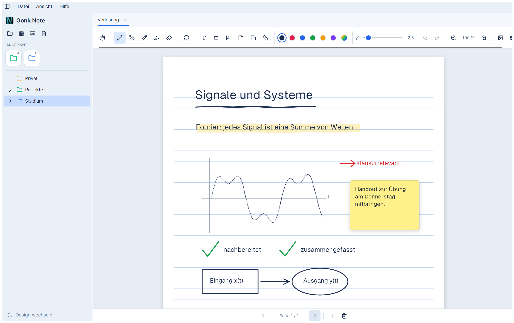
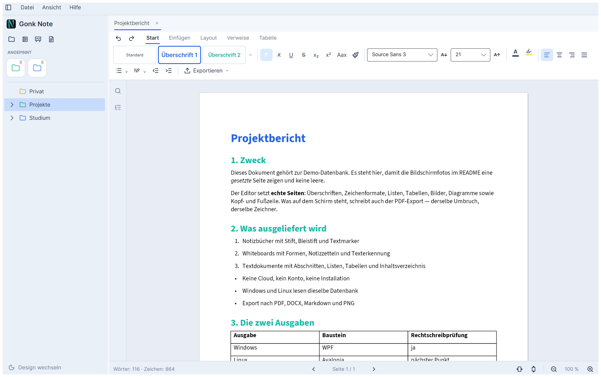
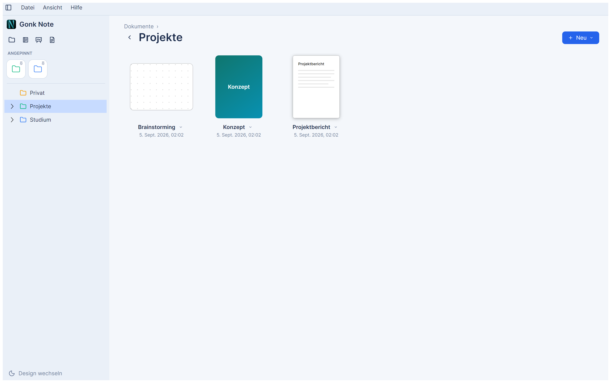

# Gonk Note

Moderne, offline-fähige Notiz-App für **Windows 11 und Linux** — eine Alternative zu
GoodNotes mit Notizbüchern, Whiteboards und Textdokumenten. Stylus-freundlich (Wacom,
Microsoft Pen, …), ohne Cloud, ohne Installation, ohne Adminrechte.

*(Deutsche Fassung. Die englische ist [`README.en.md`](README.en.md). Im Programm richtet
sich diese Seite nach der Sprache unter Ansicht → Sprache.)*



## Dokumentation

| Du willst … | Lies |
|---|---|
| Gonk Note **installieren** | [Docs/INSTALLIEREN.md](Docs/INSTALLIEREN.md) |
| **anfangen** zu arbeiten (10 Minuten) | [Docs/ERSTE-SCHRITTE.md](Docs/ERSTE-SCHRITTE.md) |
| wissen, **was** die App kann | dieses README, Abschnitt [Features](#features) |
| selbst **bauen** | [Build](#build) unten, ausführlich in [Docs/INSTALLIEREN.md](Docs/INSTALLIEREN.md) |
| **mitmachen** | [CONTRIBUTING.md](CONTRIBUTING.md) |

## Installieren

**Drei Wege, keiner braucht Adminrechte.** Alle Downloads liegen unter
[Releases](https://github.com/GONKstupid/GonkNote/releases); die Einzelheiten stehen in
[Docs/INSTALLIEREN.md](Docs/INSTALLIEREN.md).

1. **Windows 11** — `GonkNote-<version>-windows-x64.zip` entpacken, `GonkNote.exe`
   starten. Kein installiertes .NET nötig. ⚠ **Den Ordner zusammenlassen:** neben der
   Exe liegen `Fonts`, `tessdata` und `Assets`, und ohne `Fonts` zeichnet Gonk Note
   still in der Windows-Systemschrift.
2. **Linux, AppImage** — eine Datei, keine Abhängigkeiten, keine Sandbox. Voraussetzung
   ist nur **fontconfig und eine Schrift**; die Texterkennung steckt im Abbild.
3. **Linux, Flatpak** — als Hauptweg vorgesehen, **auf Flathub aber noch nicht**. Bis
   dahin selbst bauen (`packaging/flatpak/bauen.sh`).

> **Deine Daten bleiben, wo sie sind.** Gonk Note legt beim ersten Start einen Ordner an
> — `%APPDATA%\GonkNote` unter Windows, `~/.config/GonkNote` unter Linux — und schreibt
> sonst nirgendwo hin. Zum Deinstallieren reicht es, das Programm und diesen Ordner zu
> löschen.

## Zwei Ausgaben, eine App

Gonk Note gibt es als **Windows-Ausgabe** (WPF) und als **Linux-Ausgabe** (Avalonia).
Beide lesen dieselbe Datenbank, benutzen dieselbe Kernbibliothek und zeichnen mit
demselben Renderer — ein Notizbuch sieht auf beiden gleich aus.

**Beide können dasselbe.** Alles unter [Features](#features) gilt für beide: Ordnerbaum,
Galerie, zwei Sprachen, Dark/Light, eigene Designs, die Zeichenfläche für Notizbuch und
Whiteboard samt Texterkennung — und der Textdokument-Editor mit Anzeige, Import und
Export.

**Die Unterschiede sind vollständig aufgezählt** — jeder Punkt ist gemessen, keiner
geschätzt:

| Der Linux-Ausgabe fehlt | Warum |
|---|---|
| **Rechtschreibprüfung** | Sie hängt in der Windows-Ausgabe an einem Windows-Dienst. Ein Gegenstück ist der erste Punkt nach der Portierung und fest eingeplant |
| **Zusammengesetzte Zeichen** (`´` + `e` → `é`) kommen nicht an | Ein Fehler im Fenster-Baustein von Avalonia unter Linux, dort gemeldet. Einfache Zeichen und Umlaute sind nicht betroffen |
| **Lineal** über dem Textdokument | Bewusst weggelassen: in der Windows-Ausgabe ist es eine Zierleiste ohne Funktion. Die Werte stehen im Reiter „Layout" und sind dort änderbar |
| **Bestandsdokumente aus der Windows-Ausgabe** erscheinen erst nach einmaligem Öffnen und Speichern dort | Ihr altes Format liest nur Windows. Der Inhalt bleibt unangetastet |

| Der Windows-Ausgabe fehlt | Warum |
|---|---|
| **Seitenzahlen** im Texteditor | Sie rechnet keine Seiten, sondern lässt Windows den Text fließen. Die Linux-Ausgabe setzt echte Seiten und weiß deshalb, auf welcher man steht |

Nichts davon geht verloren: was eine Ausgabe nicht anzeigen kann, fasst sie auch nicht
an — eine Datei aus Windows kommt unter Linux unverändert wieder heraus.



## Features

### Verwalten

- **Ordnerbaum** mit beliebiger Verschachtelung, Drag & Drop (Verschieben, mit `Strg`
  Kopieren), Umbenennen (`F2`), Löschen (`Entf`), Kontextmenü, frei wählbare
  Symbolfarben — Elemente und Unterordner **erben die Farbe ihres Ordners**, solange sie
  keine eigene haben
- **Anpinnen & Favoriten**: angepinnte Ordner im Schnellzugriff, Favoriten zuerst
- **Galerie-Startansicht**: der aktuelle Ordner in großen Kacheln (GoodNotes-artig),
  mit Notizbuch-Cover als Vorschau, Breadcrumb und Zurück
- **Zwei Sprachen** (Deutsch/Englisch), umschaltbar unter **Ansicht → Sprache** zur
  Laufzeit; Dokumentnamen bleiben unverändert
- **Dark-/Light-Mode** (`Strg+T`); Seiten bleiben standardmäßig hell, die Titelleiste
  folgt dem Theme. Seitenleiste einklappbar (`Strg+B`)
- **Eigene Designs**: ein Design ist eine JSON-Datei mit bis zu zwanzig benannten Farben
  unter `Themes/` im Datenordner. `Ansicht → Design` listet sie neben Hell und Dunkel;
  „Vorlage speichern…" schreibt einen Startpunkt heraus, „Eigenes laden…" holt eine
  Datei von woanders. Was fehlt, kommt aus Hell bzw. Dunkel — drei Farben genügen.
  Anleitung samt KI-Prompt in [Docs/ERSTE-SCHRITTE.md](Docs/ERSTE-SCHRITTE.md#12-eigene-designs--auch-von-einer-ki-erstellen-lassen)

  

### Notizbuch & Whiteboard

- **Drei Dokumenttypen**, jeder in eigener Registerkarte: **Notizbuch** (A4/A3-Seiten
  mit anpassbarem Cover), **Whiteboard** (unendliche Fläche mit Punktraster),
  **Textdokument** (siehe unten)
- **Werkzeuge** (SkiaSharp-Rendering; Standardfarbe folgt der Seite): Stift
  (druckempfindlich), Bleistift, Textmarker
- **Formen-Stift** (`G`): erkennt gezeichnete Formen wie GoodNotes — Geraden (mit
  45°-Einrasten), Kreise/Ellipsen, Rechtecke, Streckenzüge; sonst wird geglättet
- **Radiergummi**: trennt Striche punktgenau an der Berührstelle, Stift-Rückseite
  radiert automatisch, eigene Größe getrennt von der Strichstärke gemerkt
- **Auswahl** mit **Lasso** (`L`) und **Verschieben** (`V`): ausgewählte Objekte
  verschieben, **skalieren** (Eckgriff) und **drehen** (15°-Rastung) — Striche, Formen,
  Text, Bilder, Notizzettel
- **Quick-Options-Menü** auf der Leinwand (Ausschneiden, Kopieren, Duplizieren,
  Einfügen, Text erkennen, Löschen, Alles auswählen) — per Rechtsklick, zweiter
  Stift-Taste, langem Drücken oder automatisch nach einer Auswahl; ganz ohne Tastatur
- **Textstärke per Zahlenblock**: langes Drücken auf den Größen-Regler öffnet ein Numpad
- **OCR** (offline via Tesseract, Deutsch/Englisch): erkennt gedruckten Text in Bildern
  oder importierten PDF-Seiten; Ergebnis kopieren oder als Notizzettel einfügen
- **Formen** (Linie, Pfeil, Rechteck, Ellipse, Dreieck) mit Füllfarbe und Deckkraft
- **Textfelder** mit wählbarer Schrift, Text- und Hintergrundfarbe (Kontrastschutz)
- **Notizzettel** und **Sticker** (Bild-Aufkleber; Gonk Note liefert aus Lizenzgründen
  keine mit — eigene unter `Stickers/` ablegen, Unterordner werden zu Gruppen)
- **Zeichenhilfen**: Lineal (`R`) und Geodreieck (`D`), drehbar/einrastend; eigene
  Geodreieck-SVG geht vor
- **Bilder einfügen** (PNG, JPEG, BMP, GIF, WebP, SVG) per Button, `Strg+V` oder Drag &
  Drop, proportional skalierbar
- **PDF & Word einfügen** mit Seitenauswahl-Dialog: im Notizbuch je Seite eine eigene
  Seite, im Whiteboard hochauflösende, skalierbare Bilder. **Auch sehr große PDFs** —
  nie am Stück geladen, in voller Auflösung nur die wirklich eingefügten Seiten
- **Touch-Gesten**: 1 Finger verschiebt, 2 Finger zoomen (Pinch), Drei-Finger-Doppeltipp
  = Rückgängig. Undo/Redo (`Strg+Z`/`Strg+Y`), Zoom (`Strg+Mausrad`)
- **Einstellungs-Seitenleiste** (Zahnrad): Seitenmuster und -farbton, Format, Formen-
  und Text-Optionen, Cover-Gestaltung, **Export** (PDF/PNG direkt) — wirkt sofort

### Textdokument-Editor

Ribbon-Layout (Start / Einfügen / Layout / Verweise, plus Kontext-Tab **Tabelle**):

- Zeichen-/Absatzformate, Formatvorlagen (Standard, Überschrift 1–4, Titel, Zitat,
  Kopf-/Fußzeile), Format übertragen, Listen mit Stil-Bibliothek, Suchen & Ersetzen
- **Erweiterte Einstellungen**: Seiteneinrichtung (A4/A5/A3/Letter, Ausrichtung, Ränder
  in cm inkl. Lernblatt-Vorlage), Absätze, Kopf-/Fußzeile mit Platzhaltern,
  Wasserzeichen, Tabellen-Design/Rahmen
- **Inhaltsverzeichnis** aus den Überschriften, Hyperlinks, Sonderzeichen, Beschriftungen
- **Tabellen wie in Word**: Raster-Einfügen, Text↔Tabelle, Schnelltabellen, Zeilen/Spalten,
  Zellen verbinden (auch senkrecht)/teilen, Tabelle teilen, AutoAnpassen, Sortieren,
  Formeln (`=SUMME(ABOVE)` …), Formatvorlagen mit Kopf-/Ergebniszeile und Bändern, Rahmen
  und Füllung
- **Diagramme** (Säulen, Balken, Linie, Punkt, Punkt+Linie, Kuchen, Radar — mehrere
  Reihen, Farben erweiterbar)
- **Rechtschreibprüfung** (Windows; Deutsch/Englisch in der Statusleiste umschaltbar) mit
  Korrekturvorschlägen. Statusleiste (Wörter, Zoom), Überschriften-Navigator,
  Seitenumbruch-Marken
- **Import**: Bilder, PDF, DOCX, **Markdown** (DOCX/Markdown als neue Textdokumente)
- **Export**: Textdokument → PDF / DOCX / Markdown / PNG, Whiteboard/Notizbuch → PDF /
  PNG. Fehlen zu einem Bild die Originaldaten, sagt Gonk Note das nach dem Export

### Unter der Haube

- **Persistenz**: SQLite-Datei `gonknote.sqlite` für Texte, Striche und Struktur;
  **Bilder und importierte Seiten liegen daneben** in `gonknote.blobs/` — je Bild eine
  Datei. Autosave alle 30 s, Speichern beim Schließen. **Für eine Sicherung beides
  mitnehmen: die Datei *und* den Ordner.** Bis Version 0.2.0 hieß die Datei
  `gonknote.db` (LiteDB); sie wird beim ersten Start danach einmalig übertragen und
  bleibt unverändert liegen. Aussortierte Bilder wandern für 30 Tage in
  `gonknote.papierkorb/`
- **Große Dokumente**: Originale werden unverändert abgelegt und beim Export unverändert
  zurückgeschrieben; angezeigt wird eine verkleinerte Ableitung. Ein Word-Dokument mit
  Fotos kommt genauso groß wieder heraus wie es hereinkam; ein 500-Seiten-Textdokument
  öffnet in etwa 1,8 Sekunden
- **Speicherbedarf**: rund 180 MB nach dem Start, ~290 MB mit einem geöffneten Notizbuch
  — unabhängig von der Dokumentgröße, weil nur sichtbare Seiten im Speicher liegen. Der
  Undo-Verlauf ist auf 200 Schritte begrenzt

### Tastenkürzel im Whiteboard

| Taste | Werkzeug | | Taste | Werkzeug |
|---|---|---|---|---|
| `S` | Stift | | `T` | Textfeld |
| `G` | Formen-Stift | | `F` | Formen |
| `B` | Bleistift | | `N` | Notizzettel |
| `M` | Textmarker | | `R` | Lineal |
| `E` | Radiergummi | | `D` | Geodreieck |
| `V` | Verschieben | | `H` | Hand (Leinwand verschieben) |
| `L` | Lasso | | | |

Auswahl: verschieben, skalieren, drehen · `Strg+C/X/V` · `Strg+D` duplizieren ·
`Strg+A` alles · `Entf` löschen · Rechtsklick / zweite Stift-Taste / langes Drücken =
Quick-Options-Menü.

## Build

Voraussetzung: .NET SDK 10 oder neuer. **Immer projektbezogen bauen, nie die ganze
Solution** — sie enthält beide Ausgaben, und die Windows-Ausgabe lässt sich unter Linux
nicht übersetzen.

```powershell
# Windows
dotnet run --project src/GonkNote.Wpf                 # Entwicklung
dotnet publish src/GonkNote.Wpf -c Release            # Single-File-Exe
```

```bash
# Linux (braucht fontconfig + eine Schrift)
dotnet run --project src/GonkNote.Avalonia
```

Für Tests kann mit `--db <pfad>` eine alternative Datenbank verwendet werden —
**auf einer Kopie arbeiten, nie auf dem Bestand.** Alle Einzelheiten, die
Voraussetzungen und die Fehlerbehebung stehen in
[Docs/INSTALLIEREN.md](Docs/INSTALLIEREN.md).

## Architektur

Die Anwendung besteht aus **einem Kern und zwei Oberflächen**. Datenmodell, Persistenz,
Zeichenroutinen, Farben und Übersetzungen liegen im Kern; in einer Oberfläche steht nur,
was Pixel zeichnet oder Eingaben entgegennimmt. Deshalb gibt es die Linux-Ausgabe
überhaupt — sie hat nichts davon nachgebaut.

| Baustein | Technologie |
|---|---|
| Oberfläche Windows | WPF (.NET 10), MVVM, Ressourcen-Wörterbuch zur Laufzeit aus der Farbtabelle in `GonkNote.Core` |
| Oberfläche Linux | Avalonia 12 (.NET 10), dieselben ViewModels, dieselbe Farbtabelle |
| Whiteboard-Rendering | SkiaSharp — Windows über `SKElement`, Linux über Avalonias Skia-Leinwand; **derselbe Renderer, dieselben Pixel** |
| Stifteingabe | WPF-Stylus-Events bzw. Avalonia-Pointer, beide mit Druck und Neigung |
| Persistenz | SQLite (`Microsoft.Data.Sqlite`); Dokumente als JSON über einen Source-Generator |
| Kernlogik | eigene Bibliothek `GonkNote.Core` (net10.0) — ohne UI-Abhängigkeiten |

```
src/
├─ GonkNote.Core/         Kernlogik ohne UI-Bezug (net10.0)
│  ├─ Models/            NoteItem (Baum), Whiteboard-Elemente, Enums
│  ├─ Platform/          die Naht zu den Oberflächen: Dateidialoge, Zwischenablage,
│  │                     Theme, OCR, Rechtschreibung … als Schnittstellen
│  ├─ Services/          DatabaseService (SQLite), BlobStore, UndoStack, PDF-Import
│  ├─ Rendering/         Skia-Zeichenroutinen, Geodreieck-Overlay
│  ├─ Editing/           punktgenaues Radieren, Trefferprüfung, Lasso
│  ├─ Text/              Dokumentmodell, Layout, Zeichner, Markdown-Zerleger
│  ├─ Theming/           die Farbtabelle (20 Farben) + Theme-Dateien aus Themes/
│  └─ Localization/      Loc + je eine Tabelle DE/EN
├─ GonkNote.ViewModels/   MVVM für beide Oberflächen
├─ GonkNote.Legacy/       liest Datenbanken bis Version 0.2.0 (LiteDB)
├─ GonkNote.Wpf/          Windows-Oberfläche (net10.0-windows)
└─ GonkNote.Avalonia/     Linux-Oberfläche (net10.0, läuft auch unter Windows)
```

## Lizenz

Gonk Note steht unter der **MIT-Lizenz** — siehe [LICENSE](LICENSE).
Copyright © 2026 Manuel Toegel.

Kurz: benutzen, verändern und weitergeben ist erlaubt, auch kommerziell; Lizenztext und
Copyright-Hinweis müssen mitgeliefert werden, und es gibt keine Garantie.

Die mitgelieferten **Notizbuch-Cover**, die **Geodreieck-Grafiken** und das **App-Icon**
sind eigene Werke unter derselben Lizenz. **Sticker liefert Gonk Note bewusst keine
mit.**

### Verwendete Bibliotheken

Alle Abhängigkeiten sind permissiv lizenziert und mit der MIT-Lizenz vereinbar. Die
Vermerke, die Apache-2.0 und BSD-3 bei einer Weitergabe verlangen, stehen in
[THIRD-PARTY-NOTICES.md](THIRD-PARTY-NOTICES.md):

| Baustein | Zweck | Lizenz |
|---|---|---|
| [SQLite](https://www.sqlite.org/) über [Microsoft.Data.Sqlite](https://learn.microsoft.com/dotnet/standard/data/sqlite/) | Persistenz | Public Domain / MIT |
| [LiteDB](https://www.litedb.org/) | liest Datenbanken bis Version 0.2.0 ein | MIT |
| [SkiaSharp](https://github.com/mono/SkiaSharp) | Whiteboard-Rendering | MIT |
| [Svg.Skia](https://github.com/wieslawsoltes/Svg.Skia) | SVG-Rasterung | MIT |
| [DocumentFormat.OpenXml](https://github.com/dotnet/Open-XML-SDK) | DOCX-Import/-Export | MIT |
| [Docnet.Core](https://github.com/GowenGit/docnet) / PDFium | PDF-Import | MIT / BSD-3-Clause |
| [Tesseract](https://github.com/charlesw/tesseract) + `tessdata` (deu, eng) | OCR | Apache-2.0 |
| [Lucide](https://lucide.dev) | Symbole der Oberfläche | ISC (teils MIT) |
| [Inter](https://github.com/rsms/inter) | Schrift der Oberfläche | SIL OFL 1.1 |
| [Source Sans 3](https://github.com/adobe-fonts/source-sans) | Grundschrift der Textdokumente | SIL OFL 1.1 |
| [JetBrains Mono](https://github.com/JetBrains/JetBrainsMono) | Code und Festbreitentext | SIL OFL 1.1 |
| [Space Grotesk](https://github.com/floriankarsten/space-grotesk) | Cover-Titel und große Überschriften | SIL OFL 1.1 |
| [Geist](https://github.com/vercel/geist-font) | Textfelder und Notizzettel im Whiteboard | SIL OFL 1.1 |

**Die Symbole kommen aus einer Tabelle im Programm**, nicht aus einer Icon-Schrift:
„Segoe Fluent Icons" gehört Microsoft, darf nicht mitgeliefert werden und fehlt unter
Linux. Sieben Formen sind eigene, der Rest stammt aus Lucide. **Die fünf Schriften
werden mitgeliefert** (`Fonts/`-Ordner neben dem Programm) — ohne sie sähe dasselbe
Dokument auf beiden Ausgaben verschieden aus. Die Lizenztexte liegen je Familie als
`OFL.txt` daneben.

---

## Ein ehrliches Wort zum Schluss

**Gonk Note ist ein nebenher gevibecodetes Projekt eines Schülers.** Es ist entstanden,
weil ich mit den Möglichkeiten, die es gab, nicht zurechtkam (Goodnotes war unter widows nicht brauchbar da es als auf edge basierende Progressiv web app 1. mir nicht ermöglicht hat edge zu deinstallieren, so krass viel Ram und CPU gefressen hat, dass ich teilweise nicht mal ein aderes Programm neben Goodnotes offen haben konnte (32 GB RAM btw) ohne das goodnotes und beispielsweise mein browser krass laggy wurde, Zeiten um Notizbücher zu öffnen waren so lange das es aktive genervt hat (3-12 sek), beim öffnen von großen Notizbüchern (noch unter 100 Seiten) ist Goodnotes manchmal abgestürzt und wenn nicht hatte ich durch Goodnotes allein eine CPU Auslastungvon 15% + und eine RAM Auslastung von über 90%, nach einem update hatte ich auf einmal ein fettes Fadenkreuz bekommen was man nicht ausschalten konnte und so fett war das ich teilweise nicht sehen konnte was ich schreibe und wenn das nicht genug wäre gibt es Goodnotes und alternativen (mit den ich auch nicht zurecht kam, das arbeiten mit Styles ist mir wichtig) nicht für Linux.) 

**Praktisch alles in diesem Projekt wurde von KI gemacht:** der Code, die Architektur,
die Tests, diese Dokumentation. Meine Rolle war die des Auftraggebers: entscheiden, was
gebaut wird, ausprobieren, Fehler melden, Richtung vorgeben. Das Schreiben selbst hat die
KI übernommen. Aber ich habe das App Icon in Affinity selbst erstellt.

Das heißt: nimm nichts hier als Referenz für „so macht man das". Es ist ein
Gebrauchsgegenstand, kein Lehrstück. Wenn es dir nützt, freut mich das. Wenn du einen
Fehler findest, sag Bescheid in den
[Issues](https://github.com/GONKstupid/GonkNote/issues).
